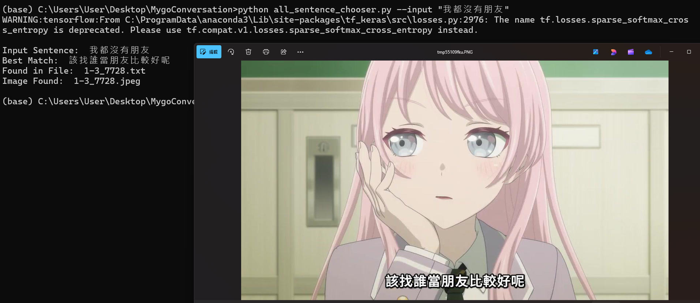

# MyGo_meme_conversation

## Environment setting
Be sure to install the latest version of the following library:
1. torch
2. tf-keras
3. sentence_transformers
4. PIL

## Cloning the Repository
Clone this project to your repository and navigate to the project directory:

```bash
cd MygoConversation
set TF_ENABLE_ONEDNN_OPTS=0
```

## Download Required Data

1. **Screenshots of MyGo Images**
   Download the screenshots from the [Google Drive link](https://drive.google.com/file/d/1rrTsw4wmsTbzYgN9JO_EQg3VBy98z2kz/view?fbclid=IwY2xjawH4hTNleHRuA2FlbQIxMAABHU3UFQNUggnsXUSzf_CVnLkv6Afov-DDY1jeMYoxmzu2wHfVzJz2LqRH5Q_aem_fOrZZT9sRkUGEQXgqinazw).
   Save the downloaded file in the `./data` folder.

2. **Extracted Text Files**
   Download the extracted .txt files from the [Google Drive folder](https://drive.google.com/drive/folders/1J7NPczoyrtd_OoZLZn7Jtruui58q9l2K?usp=sharing).
   Save these files in the `./extracted_text` folder.
   Note: Currently, only 261 extracted subtitle .txt files are available, while the expected total is approximately 1700. These files will be continuously uploaded to the provided link.
   
## Running the Script
After correctly placing the files, you can run the following command:

```bash
python all_sentence_chooser.py --input "我都沒有朋友"
```

You can replace the input text with your desired phrase.

## Example output




